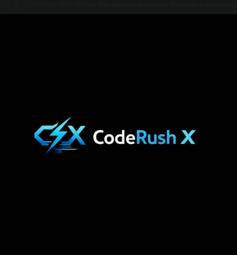

# 🚀 CodeRush X – Landing Page

A modern, responsive landing page for a **developer community** built using **HTML, CSS, and Vanilla JavaScript**.  
CodeRush X focuses on clean UI, smooth animations, and a premium tech feel to attract and onboard developers efficiently.

<p align="center">
  
</p>

<p align="center">
  <strong>Modern • Fast • Responsive • Developer-Focused</strong>
</p>

---

## ✨ Features

### 🎨 Design & UI
- 🌙 **Dark Theme** with deep navy background
- 💙 **Cyan & Indigo accents** for a modern tech look
- 🧩 **Centered Card Layout** for focused user interaction
- 🖥️ **Fully Responsive** (Mobile, Tablet & Desktop)
- ✍️ **Modern Typography** using Google Fonts (Inter)

---

### ⚡ Interactive Elements
- 🔄 **Page Loader** with animated spinner
- 📝 **Signup Form**
  - Name input
  - Email input
- ✅ **Client-side Validation**
  - Empty input check
  - Email format validation using Regex
- 🎉 **Animated Success Message** on successful submission
- ✨ **Smooth Animations**
  - Fade-up on load
  - Button hover effects
  - Input focus glow
- 📱 **Mobile Navigation** with hamburger menu

---

### 🧠 Technical Features
- 🚫 No page reload (handled via JavaScript)
- 🧪 Real-time error handling with visual feedback
- ♿ Accessibility-friendly (ARIA labels & semantic HTML)
- ⚙️ Clean, maintainable code structure
- 🚀 Fast loading (no external JS frameworks)

---

## 🛠 Tech Stack

- **HTML5** – Semantic & accessible markup  
- **CSS3** – Flexbox, Grid, Variables, Animations  
- **Vanilla JavaScript (ES6+)** – Logic & interactivity  
- **Google Fonts** – Inter font family  
- **Font Awesome** – Icons for UI elements  

---

## 📁 Project Structure

```txt
coderush-landing-page/
├── index.html
├── style.css
├── script.js
├── coderush.png
└── README.md
